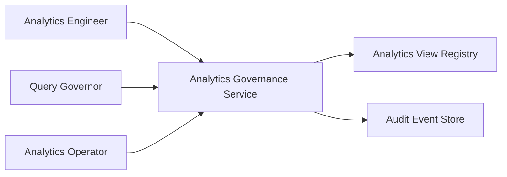
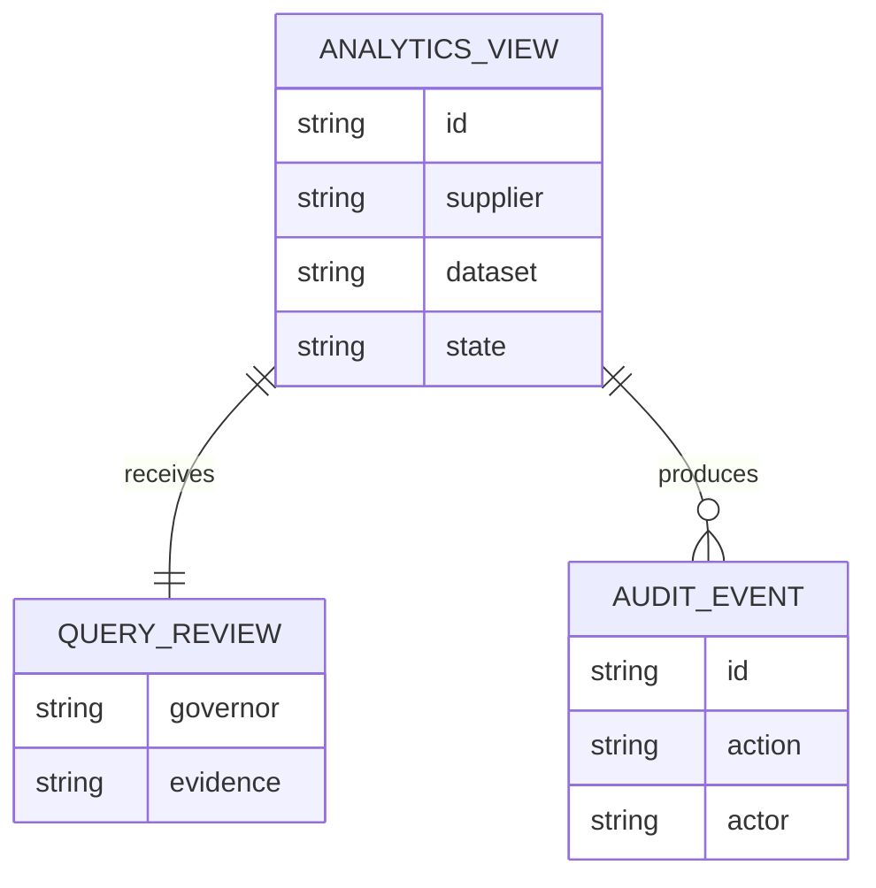
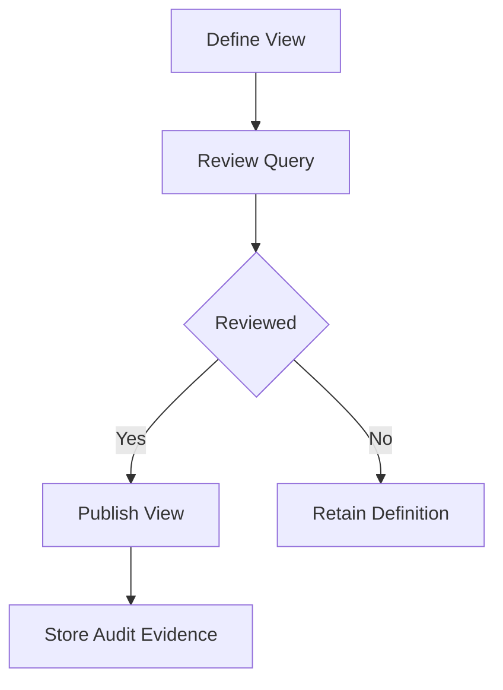
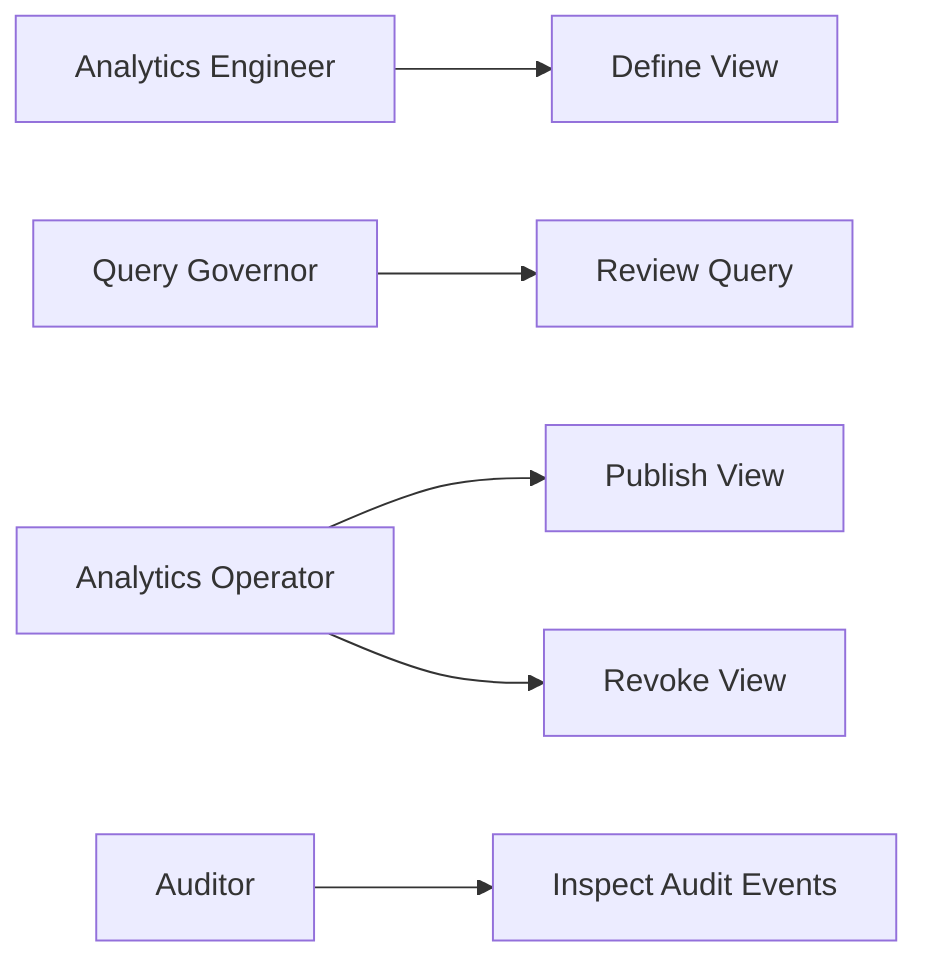
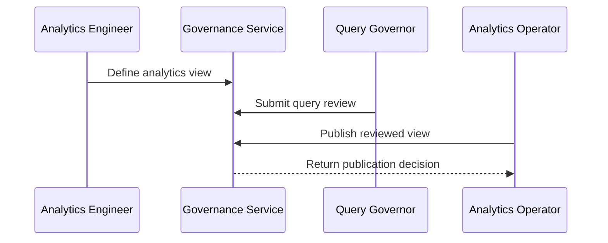

# BigQuery Supplier Analytics Governance Platform

## The Problem
Supplier analytics views can expose unreviewed query logic, unreliable metrics, or inappropriate fields when shared before cost, provenance, and access controls are verified.

## The Solution
This service governs supplier analytics views through definition, independent query review, controlled publication, and access revocation. Analytics engineering, query governance, and operating duties remain separated, with audit evidence for all decisions.

## Live Demo & Tech Stack
The LAN health endpoint is available at `http://0.0.0.0:24600/health`. The implementation uses Node.js, Express, Vitest, GitHub Actions, and BigQuery-oriented analytics governance patterns.

## Local Setup & Run Instructions
```bash
npm install
npm test
npm start
curl http://127.0.0.1:24600/health
```

## System Documentation (Mermaid.js)
### System Architecture Diagram

### Entity-Relationship Diagram (ERD)

### Data Flow Diagram

### Use Case Diagram

### Sequence Diagram


## Owner
Created and maintained by Kholipha Ahmmad Al-Amin.
Software Engineer and AI Specialist
Founder and CEO of EquiSaaS BD
Principal Consultant at AR IT Consultancy
Full Stack Developer and SaaS Product Builder
### Official links
Portfolio: https://kholipha-ahmmad-al-amin.equisaas-bd.com/
GitHub: https://github.com/kholipha-ahmmad-al-amin
LinkedIn: https://www.linkedin.com/in/kholipha-ahmmad-al-amin
X: https://x.com/al_amin5519
Facebook: https://www.facebook.com/kholipha.ahmmad.al.amin
Instagram: https://www.instagram.com/kholipha.ahmmad.al.amin
## Ownership
This project was created and is maintained by Kholipha Ahmmad Al-Amin.

